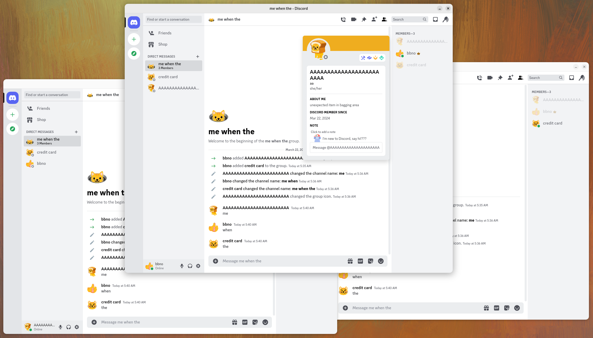

# epl
A [Litecord](https://gitlab.com/litecord/litecord) compatible/inspired OSS implementation of Discord's backend for fun 
and profit.

---

## Why?
~~Like I said, fun and profit!~~

In all seriousness, this project is intended as a way to understand the Discord API in a more familiar stack to
(hopefully) help speed up implementing new features and fixing bugs for Litecord.

As such, the Epl project has the same goals as the original Litecord project.

Being Litecord compatible also means we will be using Litecord's [LVSP protocol](https://gitlab.com/litecord/litecord/-/blob/master/docs/lvsp.md), [mediaproxy](https://gitlab.com/litecord/mediaproxy), 
and [admin API](https://gitlab.com/litecord/litecord/-/blob/master/docs/admin_api.md).

## Status

Epl is at a point where basic account and messaging features work, this includes (but is not limited to):
* Accounts
  * Creation and disabling
  * Email verification (currently stubbed)
  * Ability to turn off registration
  * Session management
* User profile and account modification
  * Changing your username
  * Modifying the "about me" section
  * Modifying pronouns
  * Modifying the banner colour
  * Uploading a user avatar
* Relationships
  * Adding other users as friends
  * Blocking users (with related permissions control)
  * Setting personal notes on other users
* Messages
  * Creating and receiving messages
  * Deleting messages
  * Editing already sent messages
  * Pinning messages
* DMs and Group DMs
  * Creating and closing DMs
  * Adding and kicking users in Group DMs
  * Editing the name and icon of Group DMs
* Pomelo (toggled via an environment variable)
  * Also includes the migration step and badge with legacy username
* Hypesquad houses
* Badges and flags
* S3 CDN proxy (with on-the-fly and cached resizing)
  * User avatars
  * Group icons
  * Badges
* Media proxy
  * Need to improve URL matching (don't match urls in codeblocks or surrounded by less/greater than signs)
  * External images don't embed, need to look what to do here as Mediaproxy doesn't send anything
  * Some sites break Mediaproxy (like Discord!)
  * Missing elements cause embeds to not show up on mobile
* April Fools
  * 2024 implemented minus the avatar deco (Enable the Packages experiment to access)
* Tenor
  * Trending, search, and suggested terms fully supported
  * Giphy soon

Some stuff in progress:
* Mutual friends list
* Admin api
  * Ignoring the guild paths for now
* Reactions
* Mobile support
  * Turns out its incredibly easy to get the React Native Discord client to change its endpoints
    * It also uses `window.GLOBAL_ENV` when starting and only requests an uncompressed JSON gateway

Some things I'm definitely adding Eventually™ are:
* Presence
* Guilds
* Attachments
* Settings sync
* Favourite gifs
* Threads

Things that at some point I want to add:
* Webhooks
* Account connections
* Stickers
* Custom emojis
* Applications
* Basic store
* Nitro
* Avatar decorations
* Profile effects
* v1/v3/v6 api support (Help with getting structs for these older versions would be nice)
* Voice support
* Fragmented compression and ETF gateway support

I probably won't implement these without external help:
* Console support
* Spotify listen along or other spotify features
* Federation
* Interoperability with other messaging platforms
* Clyde AI or other AI related features (message summaries, "chatting about" notifications)

Things completely out of scope:
* E2EE (Would require too many client side modifications)
* Interactions with the real Discord (Don't want to risk upsetting Discord)
* Some sort of canonical "flagship" instance (Massive abuse risk that I can't take the burden for)
* Commercial support (I don't have the resources to guarantee support)
* Running at real Discord scale (That would make this largely inaccessible)
* Large divergence from the Discord API (This is a *Discord* reimplementation after all)
* User tracking (There's no reason for this)
* Providing an out-of-box modified Discord client (Very legally questionable)

## Installation / Running / Configuration
See [docs/running.md](docs/running.md)

## Contributing
Please read the [contributing guide](https://git.gaycatgirl.sex/litecord/epl/src/branch/main/CONTRIBUTING.md) and the [code of conduct](https://git.gaycatgirl.sex/litecord/epl/src/branch/main/CODE_OF_CONDUCT.md).